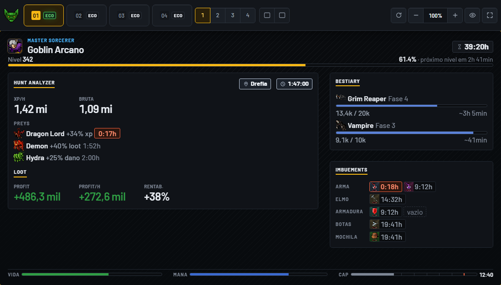

<p align="center">
  <b>Português</b> · <a href="README.en.md">English</a>
</p>

<p align="center">
  
</p>

<h1 align="center">IdleXP</h1>

<p align="center">
  <strong>Quatro contas do Huntera numa janela só — e o seu PC quase não sente.</strong>
</p>

<p align="center">
  <a href="https://github.com/idlexp-app/idlexp-releases/releases/latest/download/IdleXP-Setup.exe"></a>
  <a href="https://github.com/idlexp-app/idlexp-releases/releases/latest/download/IdleXP.dmg"></a>
  <a href="https://github.com/idlexp-app/idlexp-releases/releases/latest/download/IdleXP.AppImage"></a>
</p>

<p align="center">
  <a href="https://github.com/idlexp-app/idlexp-releases/releases/latest"></a>
  
  
  
</p>

<p align="center">
  Grátis · sem cadastro · se atualiza sozinho
</p>

---

<p align="center">
  
  <br>
  <sub>O painel do modo economia. Imagem ilustrativa, com dados de exemplo.</sub>
</p>

## Por que o IdleXP

Jogar com vários personagens no navegador é abrir várias abas, relogar toda hora e ver o
computador esquentar. O IdleXP junta as quatro contas numa janela, lembra os quatro logins e,
com o **modo economia**, fecha o navegador das contas que você não está olhando — sem parar
a caçada delas.

### O que muda no seu PC

Com as quatro contas em modo economia, comparado às mesmas quatro contas abertas normalmente:

| | Sem o modo economia | Com o modo economia | |
| --- | --- | --- | --- |
| **Processador** | 310% de um núcleo | 13% de um núcleo | **−96%** |
| **Memória** | 5,4 GB | 1,85 GB | **−66%** |
| **Placa de vídeo** | 6,5% de uso | 0,1% de uso | **−98%** |

E cada conta que sai da tela, sozinha: de **776 MB e 27% de um núcleo** para **64 MB e menos de
0,5%** — continuando a ganhar experiência.

<sub>Medido no PC do desenvolvedor em 04/09/2026: quatro telas, três contas logadas na mesma caçada
e uma deslogada, duas janelas de 60 segundos, a única diferença sendo o modo economia. Os números
do seu PC vão ser outros; a proporção é o que conta.</sub>

## O que ele faz

- **Quatro contas, quatro logins salvos.** Cada conta tem o seu próprio espaço: uma não enxerga a
  outra, e você não precisa entrar de novo toda vez que abre o app.
- **A tela do seu jeito.** De 1 a 4 telas lado a lado, ou uma grande com as outras ao lado.
  Zoom ajustável e tela cheia.
- **Modo economia.** A conta continua caçando, mas sem navegador aberto. No lugar do jogo fica um
  painel com o que importa: vida, mana, stamina, nível, **XP/h**, **Profit/h**, as **preys** ativas
  e o **bestiário** da caçada, com quanto falta para cada fase.
- **Economia automática.** Nos layouts de 1 a 3 telas, as contas que ficam fora da tela entram em
  economia sozinhas depois de 2 minutos.
- **Avisa quando algo dá errado.** Se o personagem morrer ou a stamina acabar, o cartão da conta
  mostra na hora.
- **Esconde os nomes para print e live.** Um clique tarja os nomes dos personagens no app e, dentro
  do jogo, no mapa, na party e no cabeçalho.
- **Se atualiza sozinho.** Ao abrir, o IdleXP confere se há versão nova, baixa e instala antes de
  qualquer conta abrir. Você baixa uma vez só. (No Mac ele avisa e traz você até aqui — veja abaixo.)

> O modo economia acompanha o personagem enquanto ele caça offline (VIP). Ele não mantém uma
> caçada que o jogo não manteria.

## Instalar

O IdleXP roda em **Windows, macOS e Linux**, de 64 bits. Escolha o seu:

### Windows 10 ou 11

1. Baixe o **[IdleXP-Setup.exe](https://github.com/idlexp-app/idlexp-releases/releases/latest/download/IdleXP-Setup.exe)**.
2. Abra o arquivo. Na primeira vez o Windows mostra um aviso azul (veja abaixo por quê):
   clique em **Mais informações** e depois em **Executar assim mesmo**.
3. Aceite a licença, escolha a pasta e pronto. No fim dá para abrir o app e criar o atalho.

O instalador não pede senha de administrador e instala só para o seu usuário.

### macOS (Intel e Apple Silicon)

1. Baixe o **[IdleXP.dmg](https://github.com/idlexp-app/idlexp-releases/releases/latest/download/IdleXP.dmg)** — é um arquivo só, que serve nos dois tipos de Mac.
2. Abra o `.dmg` e arraste o IdleXP para a pasta **Aplicativos**.
3. Na primeira vez o macOS diz que o desenvolvedor não foi identificado. Vá em **Ajustes do
   Sistema › Privacidade e Segurança**, role até o aviso do IdleXP e clique em **Abrir assim
   mesmo**. É uma vez só.

**No Mac o IdleXP não se atualiza sozinho.** Ele confere se existe versão nova e avisa na tela de
abertura, com o endereço desta página para você baixar. O motivo está em "É seguro?", abaixo.

### Linux (64 bits)

1. Baixe o **[IdleXP.AppImage](https://github.com/idlexp-app/idlexp-releases/releases/latest/download/IdleXP.AppImage)**.
2. Dê permissão de execução — pelo gerenciador de arquivos (Propriedades › Permissões › "Permitir
   executar") ou no terminal:
   ```
   chmod +x IdleXP.AppImage
   ```
3. Abra o arquivo. Não há instalação, não pede senha e não aparece aviso nenhum do sistema.

O AppImage não cria atalho no menu sozinho, e o IdleXP não vai oferecer criar um: se você quiser
essa integração, o AppImageLauncher da sua distribuição já pergunta. Guarde o arquivo onde ele
possa ficar — a atualização troca esse mesmo arquivo no lugar.

## É seguro?

**Sim — e você não precisa acreditar só na nossa palavra.**

### Por que o sistema mostra um aviso

O IdleXP ainda não tem **assinatura digital paga**, e cada sistema reage a isso de um jeito:

| Sistema | O que aparece | O que significa |
| --- | --- | --- |
| **Windows** | "O Windows protegeu o computador" (tela azul do SmartScreen) | "o Windows ainda não conhece este arquivo", e não "este arquivo é perigoso". Conforme mais pessoas baixam, o aviso tende a sumir |
| **macOS** | "não foi possível verificar o desenvolvedor" | a Apple cobra US$99/ano para identificar desenvolvedores, e nós não pagamos. É também por isso que o Mac não se atualiza sozinho: o macOS recusa instalar atualização de app sem assinatura |
| **Linux** | nada | o AppImage abre direto, e se atualiza sozinho |

### Como conferir que o arquivo é o original

- **Selo Immutable.** Cada versão publicada aqui é travada pelo próprio GitHub: depois de
  publicada, ninguém — nem nós — consegue trocar os arquivos. Você vê o cadeado **Immutable**
  na página da versão, e o GitHub assina um atestado que qualquer pessoa confere com o
  [GitHub CLI](https://cli.github.com/):
  ```
  gh release verify-asset IdleXP-Setup.exe -R idlexp-app/idlexp-releases
  ```
- **Código de conferência (SHA-256).** As notas de cada versão trazem o código dos três arquivos,
  com o comando de cada sistema ao lado. O resultado tem que ser igual ao das notas. Se for
  diferente, não instale.
- **O único endereço oficial é este repositório.** O IdleXP baixado de qualquer outro lugar não é
  nosso.

### O que o IdleXP nunca faz

- **Não guarda a sua senha.** Você entra na página do próprio Huntera, dentro do app, como faria no
  navegador. A senha vai para o Huntera.
- **Não manda nada para nós.** Não existe servidor do IdleXP, cadastro, telemetria nem anúncio. O
  app só conversa com o Huntera e com este repositório, para saber se há versão nova.
- **Não joga por você.** O modo economia só **lê** o que acontece com o personagem. O IdleXP não
  sabe mandar nenhuma ação de jogo: essa parte não existe no programa.
- **Não mexe nos seus logins ao ser removido.** Eles ficam numa pasta sua, e reinstalar devolve as
  quatro contas logadas.
- **Não instala atualização sem conferir.** Ela só vem deste repositório, e só é aplicada se o
  código de conferência do arquivo baixado bater com o publicado aqui.

Os detalhes estão na [nota de privacidade](PRIVACIDADE.md) e na [política de segurança](SECURITY.md).

## Dúvidas comuns

**Funciona no Mac?** Funciona, em Intel e Apple Silicon, no mesmo arquivo. A diferença é que no Mac
ele não instala atualização sozinho: avisa que saiu uma e traz você até aqui.

**E no Linux?** Também, pelo AppImage de 64 bits — sem instalar e sem pedir senha. Essa é a
primeira versão do IdleXP para Linux; se algo não funcionar na sua distribuição, nos conte numa
issue.

**Onde ficam os meus logins?** No seu computador: `%APPDATA%\idlexp` no Windows,
`~/Library/Application Support/idlexp` no macOS e `~/.config/idlexp` no Linux. Nada sai dali.

**Como remover?** No Windows, em Configurações › Aplicativos, procure IdleXP. No macOS, arraste o
IdleXP.app para o Lixo. No Linux, apague o arquivo `IdleXP.AppImage`. Em todos, os logins ficam
guardados para quando você voltar.

**Achei um problema.** [Abra uma issue](https://github.com/idlexp-app/idlexp-releases/issues/new/choose)
contando a versão, o seu sistema e o que aconteceu. Problema de segurança, relate
[em particular](https://github.com/idlexp-app/idlexp-releases/security/advisories/new).

---

<sub>O IdleXP é gratuito e não é afiliado ao Huntera. Uso sujeito à licença
([português](LICENSE) · [English](LICENSE.en.txt)). Huntera é marca de seus respectivos donos.</sub>
